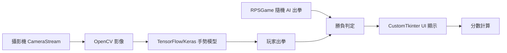

# Rock Paper Scissors — AI 對戰遊戲練習

> 用 TensorFlow/Keras + CustomTkinter 練習：攝影機辨識玩家剪刀石頭布手勢，與 AI 對戰。

**Author**: [@Lee-unhn](https://github.com/Lee-unhn) · a2264563@gmail.com  
**Status**: 學習專案 / Learning Project

## 專案簡介

使用 Python 開發的桌面遊戲，透過電腦攝影機即時出拳（剪刀、石頭、布）與 AI 對決。本專案是電腦視覺、遊戲邏輯與 GUI 整合的模組化練習，採用「UI / 遊戲邏輯 / 攝影機 / 模型」分層架構：

- **即時手勢辨識**：攝影機即時擷取 + Keras 模型推論
- **隨機 AI 對手**：簡單的隨機出拳邏輯
- **CustomTkinter UI**：現代化深色主題介面
- **遊戲流程控制**：辨識到有效出拳 → 冷卻展示結果 → 自動準備下一回合
- **計分**：分數追蹤 + 手動重置

## 架構



## 技術棧

- Python 3.8+
- TensorFlow / Keras（`models/converted_keras/saved_model.pb`）
- OpenCV（攝影機與影像）
- CustomTkinter（GUI）
- Pillow、NumPy

## 主要檔案

- `ui/app.py` — UI 進入點
- `game_logic/rps_game.py` — `RPSGame` 類別（勝負規則、分數、AI 隨機出拳）
- `camera_utils/camera_stream.py` — `CameraStream` 類別（攝影機初始化、擷取、釋放）
- `models/converted_keras/` — TensorFlow SavedModel + labels
- `requirements.txt`

## 使用 / Usage

### 1. 前置條件
*   Python 3.8 或更高版本。
*   已連接的電腦攝影機。

### 2. (建議) 建立虛擬環境
在專案根目錄下執行：
```bash
# Windows
python -m venv venv
venv\Scripts\activate

# macOS / Linux
# python3 -m venv venv
# source venv/bin/activate
```

### 3. 安裝依賴
本專案所需的主要套件都記錄在 `requirements.txt` 中，可一次性安裝：
```bash
pip install -r requirements.txt
```
主要依賴包含 `customtkinter`, `opencv-python`, `tensorflow`, `Pillow`, `numpy`。

### 4. 執行應用程式
確保您的攝影機已連接。然後，從專案根目錄執行以下指令來啟動遊戲：
```bash
python ui/app.py
```

### 遊戲玩法
1.  程式啟動後，將您的手放在攝影機前。
2.  做出「剪刀」、「石頭」或「布」的手勢。
3.  應用程式會在辨識到您的手勢（且可信度足夠高）後，觸發一局對戰。
4.  AI 會同時出拳，畫面會顯示您和 AI 的選擇以及該局的勝負結果。
5.  短暫延遲後，遊戲會自動重置，準備下一局。
6.  您可以隨時點擊「重置分數」按鈕來清空計分板。

## 備註

本專案為 AI 視覺應用學習練習，模型路徑與部分設定可能為硬編碼。如要重現請依 README 調整。
